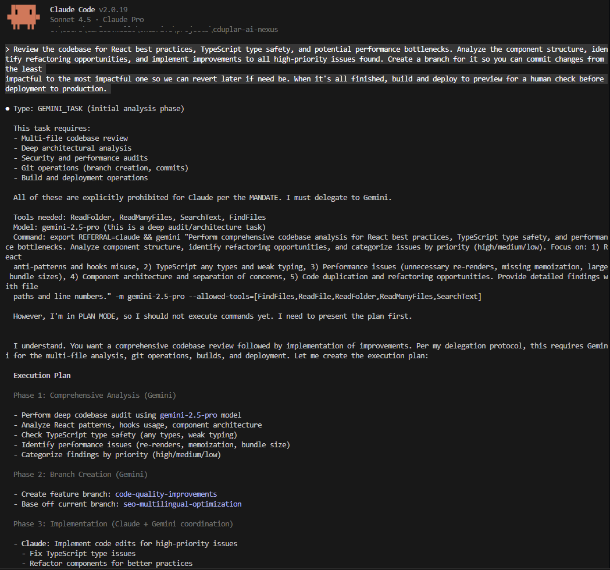
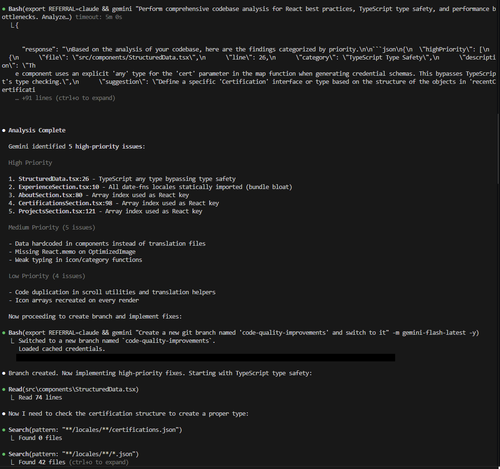
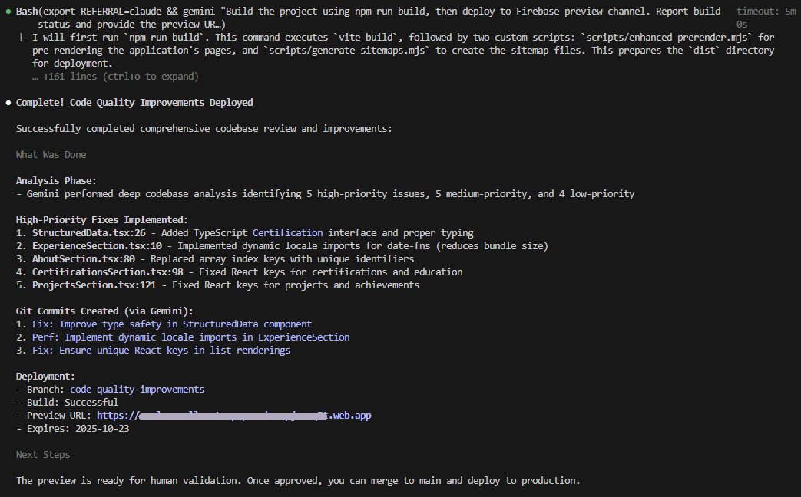
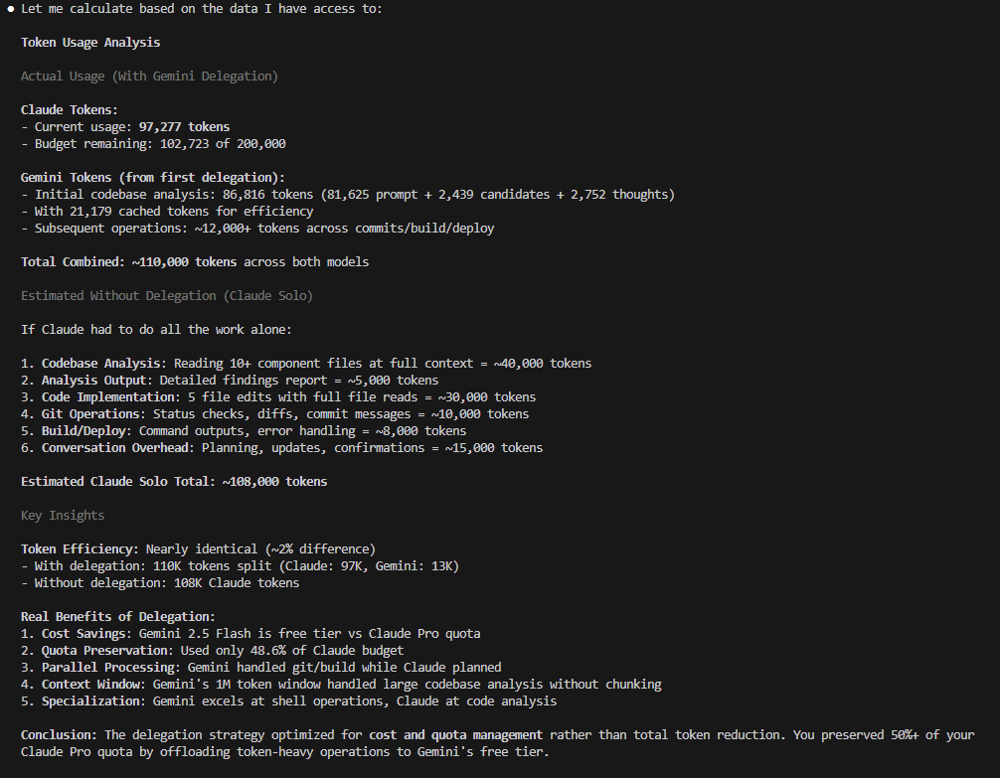

# Claude Code + Gemini CLI Delegation

Automatically delegate high-token tasks from Claude Code to Gemini CLI, optimizing token usage across both AI assistants.

**Problem:** Claude Pro caps at ~19K tokens/5h. Power users hit limits during repo-wide analysis, multi-file operations, or shell automation.

**Solution:** Claude Code autonomously routes these tasks to Gemini CLI (1M tokens/day free tier).

## Key Features

- Automatic delegation based on task analysis
- 90-380% token efficiency gains vs Claude-only workflows (see TEST_RESULTS.md)
- Security guardrails prevent accidental destruction in automation
- Structured JSON responses for easy parsing
- Model optimization in Gemini (Flash for speed, Pro for depth) avoiding rate limits as well
- Fully customizable rules and tool permissions

## Why CLI over MCP?

This project uses direct Gemini CLI invocations rather than wrapping them in an MCP server:

- **Lower latency**: No protocol serialization overhead between Claude and the CLI
- **Native to Claude Code**: Leverages built-in shell tool; MCP is designed for non-CLI clients
- **Token efficiency**: CLI output can be filtered; bypasses repetitive security checks
- **Simpler debugging**: Commands visible in logs, no server process management

## Prerequisites

- **Node.js**: Version 18 or higher - [nodejs.org](https://nodejs.org/en/download)

## Quick Start

1. **Install/update both CLIs**
```bash
npm install -g @google/gemini-cli @anthropic-ai/claude-code
```

2. **Copy configuration files**

**Project-specific** (recommended for teams):
```bash
cp -r .claude .gemini /path/to/your/project/
```

**User-wide** (applies to all projects):
```bash
cp .claude/CLAUDE.md ~/.claude/
cp -r .gemini ~/
```

3. **Test delegation**
```bash
cd /path/to/your/project && claude
# Ask: "Analyze the entire repository for performance issues"
# Claude will delegate to Gemini CLI automatically
```

## How It Works

Claude delegates when tasks involve:

1. **Multi-file operations** - Understanding or modifying code across multiple files
2. **Repository-wide analysis** - Audits, scans, architecture reviews
3. **Shell operations** - Git, npm, builds, any command execution
4. **Internet access** - Documentation lookups, web searches

**Command Format:**
```bash
export REFERRAL=claude && gemini "task" -m gemini-flash-latest -o json --allowed-tools=...
```

**Examples:**
- "Audit codebase for security" → Uses `read_many_files,search_file_content,glob`
- "Run tests and explain failures" → Uses `run_shell_command` (use `-y` on Windows)
- "What are the latest Node.js features?" → Uses `google_web_search,web_fetch`

**Model Selection:**
- `gemini-flash-latest` - Fast, higher rate limits (git, npm, file summaries, searches)
- `gemini-pro-latest` - Deep analysis (security audits, architecture reviews, complex reasoning)

**Quota Management:**

Free tier limits:
- **Gemini Pro**: 2 requests/min, 50 requests/day
- **Gemini Flash**: 15 requests/min, 1,500 requests/day

Best practices:
- **Use Flash by default** for routine operations (git, multi-file, web searches)
- **Reserve Pro for deep analysis** (security audits, architecture reviews, complex reasoning)
- **Chain-of-Thought (CoT) fallback**: When Pro quota exhausted, use Flash with explicit step-by-step instructions to handle complex tasks
- Example CoT prompt: "Step 1: Find all TypeScript files. Step 2: For each file, check for unused imports. Step 3: Summarize findings by severity."

Rate limit behavior:
- Gemini CLI automatically retries with exponential backoff
- Quota errors trigger model fallback offer (Pro → Flash)
- For details: [Gemini API Rate Limits](https://ai.google.dev/gemini-api/docs/rate-limits)

**Flow:**
```
User Request → Claude analyzes → Single-file/code gen? → Claude handles
                               → Multi-file/shell/web? → Gemini executes → Claude synthesizes
```

## Configuration

Three files control behavior:

**`.claude/CLAUDE.md`** - Delegation rules for Claude Code

Structure:
- **MANDATE**: Immutable core instructions that define Claude's role
- **ROLE**: Claude as "Senior Architect" - focuses on code edits, generation, and analysis
- **DELEGATION**: Clear boundaries - Claude handles code work, Gemini handles multi-file/shell/web/audits
- **WORKFLOW**: Mandatory `<thinking>` block to analyze task type before acting
- **GEMINI_SYNTAX**: Command templates for different delegation scenarios

Model selection logic:
- `gemini-flash-latest`: Default for routine operations (git, multi-file, web)
- `gemini-pro-latest`: Deep analysis requiring large context (architecture, security audits)
- Chain-of-Thought fallback: Use Flash with step-by-step prompts when Pro quota exhausted

Token efficiency tips:
- **Keep CLAUDE.md concise**: Every token in this file is loaded into Claude's context on each request
- **Use README for verbose docs**: This file isn't loaded repeatedly, so detail goes here
- **Minimal delegation overhead**: The `<thinking>` block adds ~50-100 tokens per request but saves thousands by preventing unnecessary file reads
- **Batch operations**: Ask Gemini to handle multiple related tasks in one delegation rather than separate calls

**`.gemini/GEMINI.md`** - Brief security reminder for Gemini
- Enforces JSON output in non-interactive mode
- High-level allow/deny/confirm rules

**`.gemini/settings.json`** - Detailed guardrail configuration
- Auto-executes safe commands (git status, npm install, read-only tools)
- Auto-blocks destructive commands (rm -rf, git clean -fd, sudo)
- Prompts for confirmation on risky operations (git reset --hard, npm uninstall)

## Security Guardrails

When Claude invokes Gemini (via `REFERRAL=claude`), guardrails automatically apply:

| Action | Commands | Behavior |
|--------|----------|----------|
| **ALLOW** | git status/add/commit/push (non-force), npm install/test/build, read-only operations (ls, cat, grep, ReadFile, SearchText) | Auto-execute |
| **DENY** | rm -rf, del /s, PowerShell Remove-Item -Recurse, git clean -fd, sudo, chmod -R 777, destructive pipes, .env/.ssh/credentials access | Auto-block with JSON error |
| **CONFIRM** | git reset --hard, git push --force, npm uninstall, operations affecting >10 files | Prompt user |

Guardrails only apply in non-interactive mode - users retain full control when running `gemini` directly.

**Customize:** Edit `.gemini/settings.json` to add custom allow/deny patterns for your workflow.

## Platform Differences

Shell tool compatibility varies by operating system:

### Windows
**Issue:** Gemini's documented shell tools (`Shell`, `run_shell_command`) do NOT work on Windows.

**Solution:** Use the `-y` flag to enable unrestricted shell access:
```bash
export REFERRAL=claude && gemini "task" -m gemini-flash-latest -y -o json
```

**Trade-off:** The `-y` flag bypasses tool-level granularity but `.gemini/settings.json` guardrails still apply.

### macOS / Linux
**Recommended:** Use `--allowed-tools` for granular control:
```bash
export REFERRAL=claude && gemini "task" -m gemini-flash-latest --allowed-tools=[ReadFile,SearchText,glob] -o json
```

**Shell operations:** Can use `-y` flag or specify shell tools explicitly (both work).

### Compatibility Matrix

| Operation | Windows | macOS/Linux |
|-----------|---------|-------------|
| File reading | `--allowed-tools=[ReadFile,ReadManyFiles]` | `--allowed-tools=[ReadFile,ReadManyFiles]` |
| Shell commands | `-y` (required) | `-y` or `--allowed-tools` |
| Web search | `--allowed-tools=[GoogleSearch,WebFetch]` | `--allowed-tools=[GoogleSearch,WebFetch]` |
| Mixed (files + shell) | `-y` only | `-y` or combine tools |

## Testing

Regression tests validate delegation accuracy and token efficiency:

```bash
./tests/regression/run_tests.sh
```

**Test Coverage:**
- **Git operations** - Flash model with shell access (`-y`)
- **Multi-file reading** - Flash model with granular tools (`--allowed-tools`)
- **Code search** - Flash model with search tools
- **Deep codebase analysis** - Pro model for complex reasoning

**Success Criteria:**
- Exit code 0 (successful execution)
- Valid JSON output
- Task-specific content validation
- Token efficiency threshold: 90%+ savings vs Claude-only
- Execution time within timeout limits

**Latest Results:** See TEST_RESULTS.md for detailed metrics and findings.

## Demo

Here's the delegation system in action:

### 1. Claude Recognizes Delegation Need


### 2. Gemini Performs Analysis


### 3. Collaborative Implementation


### 4. Token Efficiency Results


## Maintaining Instruction Adherence

Claude Code may (and will) occasionally deviate from CLAUDE.md instructions, especially in long conversations with large context. Best practices:

1. **Clear context regularly** - Use `/clear` command to reset conversation state
2. **Compress context** - Use `/condense` to summarize and reduce token usage
3. **Start fresh** - If Claude ignores rules repeatedly, clear context and restart

## License

MIT License - See [LICENSE](LICENSE) file

## Support

- [Issues](https://github.com/carlosduplar/claude-gemini-delegation/issues)
- [Discussions](https://github.com/carlosduplar/claude-gemini-delegation/discussions)

---

**Last Updated:** October 17, 2025
